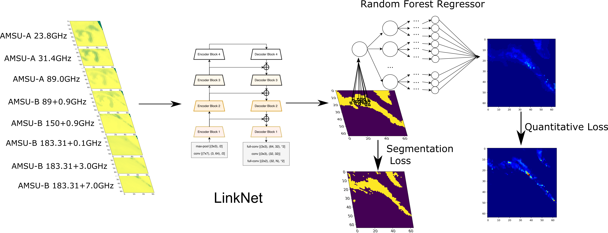
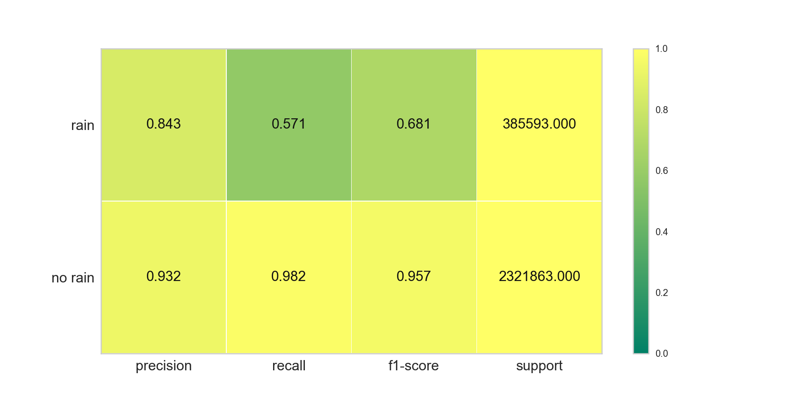
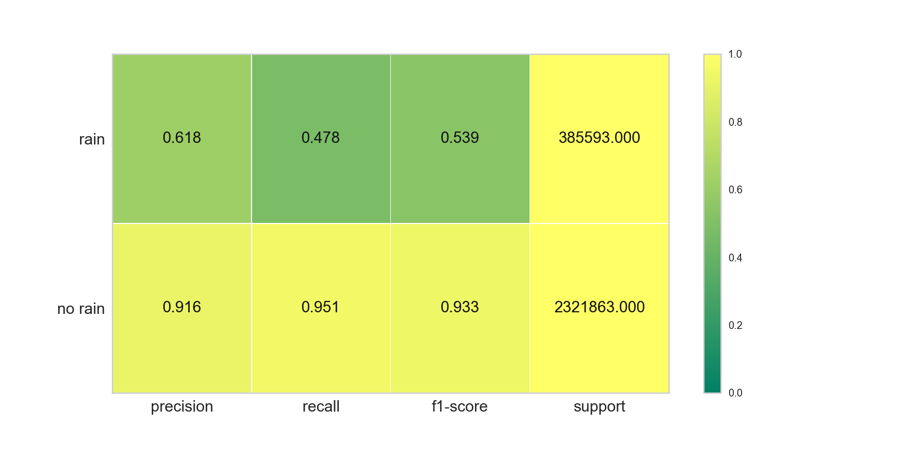
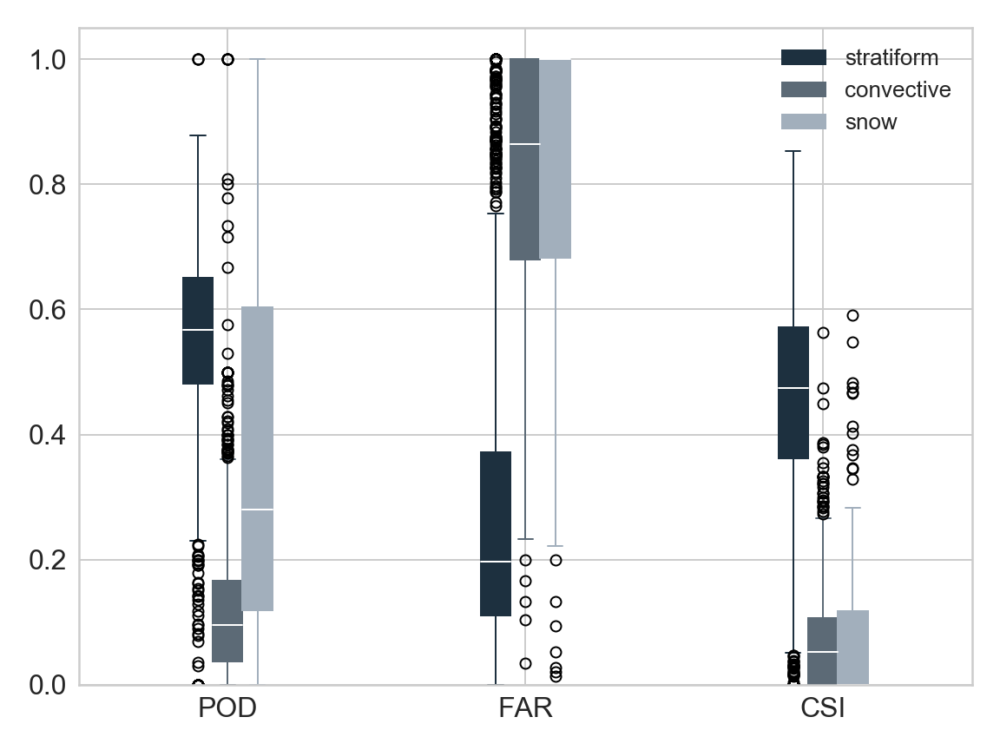
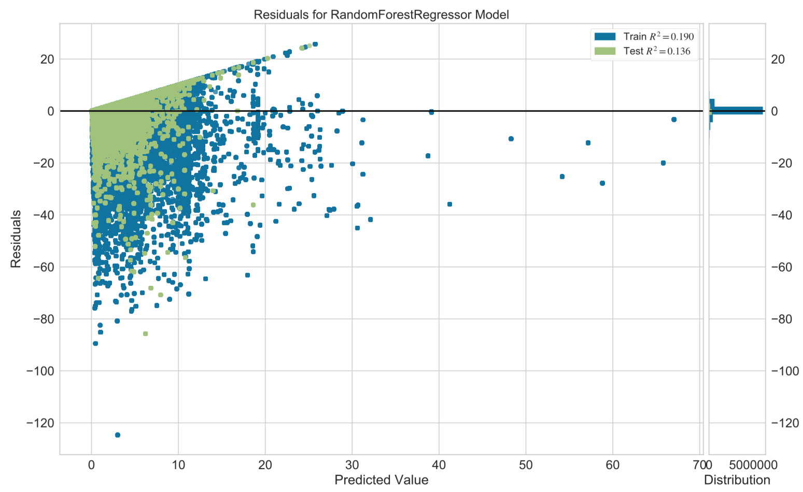

# Passive Microwave Precipitation Retrieval with deep learning

<p align="center">


In this study, we take two steps towards passive microwave (AMSU) precipitation retrival: first, segment satellite imagery into rain and no-rain classes (binary); second, apply second-round ML with rainy pixels.

<p align="center">
<p align="center">Fig.1 Schematic overview of the pipeline processing AMSU data.

## Pre-process

We crop AMSU satellite swath which is approximatly 45km at nadir into (64,64) sub-imageries randomly.

AMSU-A channels 1,2, 15 and AMSU-B channels 1, 2, 3, 4, 5 are selected as inputs because the low frequency channels (AMSU-A) are targeting water vapor in liquid phase, and higher frequencies (AMSU-B) are targeting mix-phase water.

As for the target, we mapped NSSL MRMS (multi-radar multi-sensor) ground based radar QPE to match the same spatiotemporary feature as AMSU flight. 

## Satellite imagery segmentation
In the imagery segmentation, we performed LinkNet with pretrained model that trained by imagenet.

|Model description|inputs|learning type|epoches|loss|dice|threshold|name|
|:---------------:|:----:|:-----------:|:-----:|:--:|:--:|:-------:|:--:|
|LinkNet+ResNet18|amsu-a(1,2,3,4)+amsu-b(5 channels)|unfreeze|100|0.68|0.95|-4.464768/7|segmentation-class1|
|LinkNet+ResNet18|amsu-b (4channels)|unfreeze|100|0.60|0.82|0.75|Segmentation-4channels

<p align="center">


<p align="center"> Fig.2 LinkNet Architecture


### Comb1 - UNet + ResNet18 + 8 channels + 1 class 
__Loss__


<p align="center"> Fig.3 Loss evolution with epoches

__Dice__


<p align="center"> Fig.4 Dice evolution with epoches

__Results__

<p align="center"> 


<p align="center"> 

<p align="center"> 

<p align="center"> Fig.5 LinkNet-1class-8channels-benchmark results 

<p align="center">

<p align="center"> Fig.6 Classification report for LinkNet

<p align="center">

<p align="center"> Fig.7 Classification report for Benchmark


<p align="center"> 

<p align="center"> Fig.8 PR-AUC curve to determine the best threshold 

<p align="center"> 

<p align="center"> Fig.9 objective surface plot.

## Precipitation type segmentation

We used the same structure for precipitation type segmentation. However, the results are not satisfactory especially for convective and snow case.

<p align="center"> 
<p align="center">Fig. 10 precipitation type segmentation results

## Rainfall retrieval

Attempt to use Random forest Regressor to quantify rain rate with grid search. The validation is based on KFolds, specifically 5 folds to validate data. It is running in 48 cores server, and it costs 60 hours to complete.

```python
# Grid search for hyperparameter tuning
rf= RandomForestRegressor()
hyperparam_grid= {
    'n_estimators': np.arange(10,500,20),
    'max_depth': np.arange(10,50,5),
    'warm_start':[True, False]
}
gridsearch= GridSearchCV(rf, hyperparam_grid, scoring='neg_mean_squared_error', verbose=2, n_jobs=-1)
```

|Regressor|Parameters|median RMSE (benchmark)|R^2 (train/test)|model name|
|:-------:|:--------:|:--:|:--------:|:---:|
|Random Forest|depth-10,estimators-800|1.05(12.09)|0.21/0.13|model-1|
|Random Forest|depth-9, estimators-600|-|0.19/0.36|modeol-2|
|Adaboost model-2|depth-9, estimators=600|-|-|model-3|
|Adaboost model-1|depth-10, estimators=800|-|-|model-4|


#### Results

<p align="center">

<p align="center"> Fig.11 Spatial rainfall map for benchmark and model-1

<p align="center">

<p align="center"> Fig.12 RMSE results for benchmark and model-1

<p align="center">

<p align="center"> Fig.13 Residual plots of training and test results for model-2

__feature Importance__

|Model|23.8 GHz|31.4 GHz|89.0 GHz|89+0.9 GHz|150+0.9 GHz|183.31+0.1 GHz|183.31+0.3 GHz|183.31+7.0 GHz|
|:---:|:-------:|:--:|:---:|:----:|:---:|:---:|:----:|:---:|
|model-1|0.1033|0.0654|0.0774|0.2109|0.3645|0.0319|0.0843|0.0622|
|model-2|0.0473|0.0313|0.0542|0.1983|0.5371|0.0173|0.0499|0.0644|